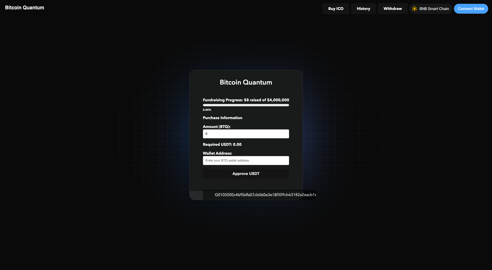

# Guide to buy BTQ (ICO)

<figure><figcaption></figcaption></figure>

#### How to Buy BTQ through the ICO Interface

1. **Connect Your Wallet:**
   * Ensure your wallet is connected to the BNB Smart Chain.
   * Click on the "Connect Wallet" button located at the top right corner of the screen.
   * Follow the prompts to connect your wallet. Make sure you have USDT in your wallet.
2. **Fundraising Progress:**
   * Check the fundraising progress bar to see how much has been raised towards the $4,000,000 goal.
3. **Enter Purchase Information:**
   * **Amount (BTQ):**
     * In the "Amount (BTQ)" field, enter the number of BTQ tokens you wish to purchase.
   * **Required USDT:**
     * The required amount of USDT will be calculated automatically based on the BTQ amount entered.
   * **Wallet Address:**
     * Enter your BTQ wallet address where you want the purchased BTQ to be sent. Ensure this is a valid BTQ address, typically starting with "Q".
4. **Approve USDT:**
   * Click on the "Approve USDT" button.
   * This will prompt a transaction in your connected wallet to approve the spending of the specified USDT amount.
   * Confirm the transaction in your wallet application.
5. **Complete Purchase:**
   * Once the USDT approval is confirmed, you should see a new button to "Buy BTQ".
   * Click this button to complete the purchase transaction.
   * Confirm the transaction in your wallet application.
6. **Check Transaction Status:**
   * After completing the transaction, you can check the status in your wallet or on the BTQ Block Explorer.
   * Ensure the BTQ tokens are received in your specified BTQ wallet address.
7. **View Purchase History:**
   * You can view your purchase history by clicking on the "History" button at the top of the interface.
8. **Withdraw Funds (Optional):**
   * If needed, you can withdraw funds by clicking the "Withdraw" button at the top of the interface.

#### Important Notes:

* Make sure you have enough USDT in your wallet before initiating the purchase.
* Double-check your BTQ wallet address to ensure it is correct.
* Approve the required USDT amount first before attempting to complete the purchase.
* If you encounter any issues, refer to the support or FAQ sections provided by the ICO platform.

By following these steps, you should be able to successfully purchase BTQ tokens through the ICO interface.
