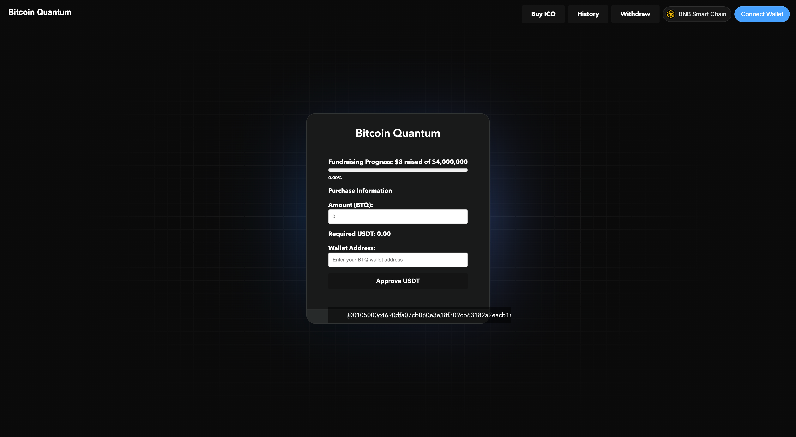

# BTQ Wallet Create

This guide will assist you in creating a secure digital wallet for managing your BTQ, a state-of-the-art cryptocurrency that blends Bitcoin's trusted framework with advanced quantum-resistant security measures. Whether you are a cryptocurrency novice or an experienced user, this tutorial is designed to provide you with a straightforward approach to securely manage your digital assets.

## Getting Started

Creating a new wallet in a cryptocurrency system is a critical step for securely managing your funds. The image you provided shows the interface for creating a wallet, likely for a cryptocurrency that uses XMSS (eXtended Merkle Signature Scheme) for its cryptographic security. Below is a step-by-step tutorial on how to create a wallet based on the interface you shared:

<figure><figcaption>
Create Wallet BitcoinQ
</figcaption></figure>

1. [**Open the Wallet Creation Page**](https://wallet.bitcoinq.xyz)**:** Begin by navigating to the cryptocurrency wallet creation interface where you are prompted to enter a passphrase and confirm it.
2. **Enter a Secure Passphrase:**
   * **Passphrase Requirements:** Your passphrase should be robust, containing at least 8 characters, including at least one number and one letter. Consider using a mix of upper and lower case letters, numbers, and symbols to increase security.
   * **Inputting the Passphrase:** Type your chosen passphrase into the "Passphrase" field. Make sure to remember it or store it securely, as losing the passphrase could result in losing access to your funds.
3. **Confirm Your Passphrase:**
   * **Passphrase Confirmation:** Re-enter the same passphrase in the "Confirm Passphrase" field to ensure there are no typing errors.
4. [**Understand the XMSS Tree Configuration**](btq-wallet-overview.md#btq-address-options)**:**
   * **Tree Height:** By default, the tree height is set to 10, which provides 1,024 one-time signatures. You can select higher tree heights for added security, but generating the wallet will take more time.
   * **Hash Function:** The default hash function used is SHAKE\_128. This can typically be changed to other hash functions if available, depending on your security needs and preferences.
5. **Create the Wallet:**
   * **Finalize Settings:** Review all settings to ensure they are correct. The interface might have additional options or settings based on the specific cryptocurrency or wallet.
   * **Generate Wallet:** Click the “CREATE WALLET” button to generate your new wallet. This process might take some time, especially if a higher XMSS Tree height is selected.
6. **Secure Your Wallet Details:**
   * **Backup Information:** Make sure to securely back up your passphrase, wallet address, hexseed, and mnemonic phrase (if provided). These details are crucial for accessing and recovering your wallet.
   * **Store Safely:** Avoid storing your passphrase or other sensitive information in plaintext or online without encryption.
7. **Waiting and Confirmation:**
   * **Be Patient:** The creation of the wallet, especially with high security settings, may take a significant amount of time. Wait until the process completes without interrupting.
   * **Confirmation:** Once the wallet is created, you should receive a confirmation along with details about how to access and use your new wallet.

<figure><figcaption>
Your new wallet details
</figcaption></figure>


You must save the details on this page or risk losing funds sent or allocated to this wallet address.


### Understanding Your Wallet Details

1. **BTQ Address:**
   * **Purpose:** This is your public wallet address, used to receive funds. Think of it as your account number in the world of cryptocurrency.
   * **Example:** `0Q10050096ff9e16c83e2f146bff7223526875d0848b95ae0d8c0d7a444419403142b2ceef1f2a3`
   * **Security Tip:** You can share this address publicly to receive funds, but never your private keys or passphrase.
2. **Mnemonic Phrase:**
   * **Purpose:** This is a human-readable form of your wallet’s private key, usually composed of 12 or more words. It's used to recover your wallet if you lose access to your device.
   * **Example:** "absorb filled squat nape thorn manic clinch dogma vital grey twelve witch cyprus limit freed knit ballet bundle crude noisy string albeit induce sweet silk peril jail park irony tricky hebrew paddle incur choux"
   * **Security Tip:** Write this phrase down on paper and store it in a secure location. Never store it digitally or share it online.
3. **Hexseed:**
   * **Purpose:** This is another format of your wallet’s private key, represented in hexadecimal. It serves the same purpose as the mnemonic phrase for wallet recovery.
   * **Example:** `010500db3933e398662bc3e3f47614ecafbf73607f357178210c1fe341965d8c0556fd6c7c86a1f73492f72e4ae367a9db6f0299`
   * **Security Tip:** The hexseed should be kept secret and secure, similar to the mnemonic phrase. Consider storing it separately from your mnemonic phrase for added security.

#### Actions to Take

1. **Open Wallet:**
   * Click this if you want to access your wallet immediately to view balances, initiate transactions, or manage your funds.
2. **Save Unencrypted Wallet File:**
   * This option will save a copy of your wallet file without encryption. It's not recommended due to security risks unless you are storing it in a highly secure, offline environment.
3. **Save Secure Wallet File:**
   * Preferably, choose this option to save your wallet file with encryption. You will likely need your passphrase to access it later, adding an additional layer of security.

#### Final Tips

* **Backup and Security:** Ensure you have multiple backups of your mnemonic phrase and hexseed, stored in different physical, secure locations.
* **Avoid Digital Storage:** Do not store your sensitive wallet information in digital form on any device connected to the internet to protect against hacking.
* **Regular Checks:** Periodically verify that your backup information is accessible and legible to avoid problems in the future should you need to recover your wallet.

<figure><figcaption>
Open Wallet
</figcaption></figure>

### How to Open Your Cryptocurrency Wallet

**Option 1: Wallet File**

1. **Choose the Wallet File:**
   * Click on “Choose File” and select the wallet file from your computer. This file was previously saved when you created or backed up your wallet.
   * If the file is encrypted, you'll need to enter the passphrase you set when creating or saving the wallet file.
2. **Enter the Passphrase (if required):**
   * If your wallet file is encrypted, type your passphrase in the provided field to decrypt it.
3. **Unlock the Wallet:**
   * Click on “UNLOCK WALLET” to access your wallet.

**Option 2: Mnemonic Phrase**

1. **Select Mnemonic Phrase:**
   * From the dropdown menu next to the wallet file button, select "Mnemonic Phrase."
2. **Enter Your Mnemonic Phrase:**
   * Type your mnemonic phrase into the text field that appears. This is the same phrase you noted down during the wallet creation process.
3. **Unlock the Wallet:**
   * Click “UNLOCK WALLET” to open your wallet.

**Option 3: Hexseed**

1. **Select Hexseed:**
   * Choose "Hexseed" from the dropdown menu.
2. **Enter Your Hexseed:**
   * Input the hexseed in the text field provided. This hexseed is a hexadecimal representation of your private key.
3. **Unlock the Wallet:**
   * Press “UNLOCK WALLET” to gain access to your wallet.

**Option 4: Ledger Nano**

1. **Select Ledger Nano:**
   * Select "Ledger Nano" from the dropdown options.
2. **Connect Your Ledger Nano:**
   * Connect your Ledger Nano device to your computer and enter its pin to unlock it.
3. **Access the Wallet:**
   * Ensure the appropriate cryptocurrency app is open on your Ledger Nano, and then click “UNLOCK WALLET” to synchronize it with the interface.

#### Security Tips

* **Keep Your Recovery Details Private:** Never enter your passphrase, mnemonic phrase, or hexseed on a computer that you suspect might be compromised.
* **Secure Connections Only:** Ensure that you are accessing your wallet in a secure environment, using a trusted network to avoid interception of sensitive data.
* **Regularly Update Software:** Keep your wallet software and hardware (like Ledger Nano) updated to protect against vulnerabilities.

By following these steps and maintaining good security practices, you can safely manage and access your cryptocurrency wallet.
